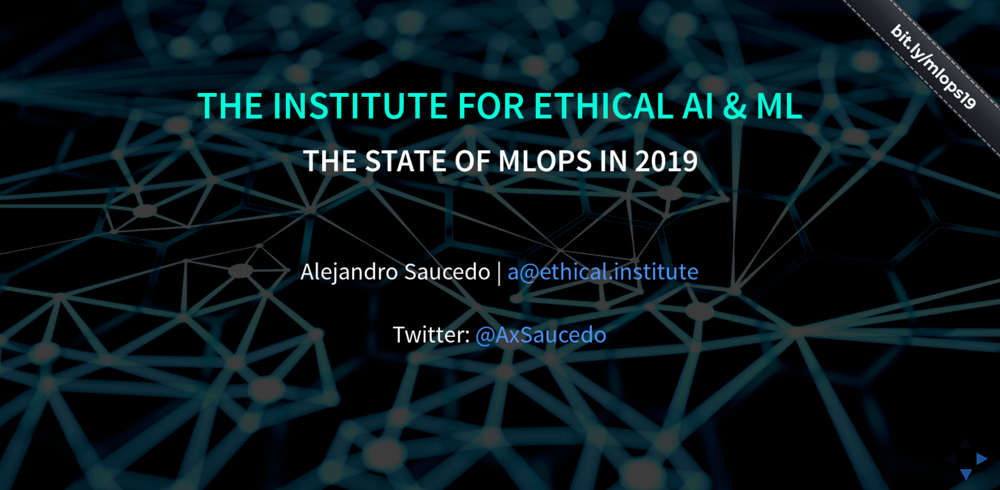

# Kubecon Shanghai 2020: The state of machine learning operations in 2020

This repository contains a presentation of the state of machine learning operations in 2020. 

<table>
  <tr>
    <td width="30%">
        <a href="https://www.youtube.com/watch?v=Ynb6X0KZKxY">Click here to watch the video of a short version of the talk at FOSDEM 2018</a>
    </td>
    <td width="70%">
        
    </td>
  </tr>
</table>

<table>
  <tr>
    <td width="30%">
        <a href="https://github.com/EthicalML/awesome-production-machine-learning">Click here to check out the Awesome Production ML Repo</a>
    </td>
    <td width="70%">
        
    </td>
  </tr>
</table>

## Contents

* This talk contains an overview of the production machine learning ecosystem in 2020.
* It provides an insight on the relevant themes [which are all listed in our Awesome Production ML list](https://github.com/EthicalML/awesome-production-machine-learning)
* For each theme, we dive into its definition, challenges, libraries available and a hands-on example
* We cover dive into three themes:
    * Explainablility of Black Box Models
    * Production Machine Learning Orchestration
    * ML Model Reproducitbility and Versioning
* As an overview, the content for each of the themes is as follows:
    * ML Model Reproducitbility and Versioning
        * Abstraction of code, config and data
        * [Example building an re-usable NLP pipeline with Kubeflow + deploying with Seldon](https://github.com/SeldonIO/seldon-core/blob/master/examples/kubeflow/kubeflow_seldon_e2e_pipeline.ipynb)
        * Other libraries, including MLFlow, DVC and Pachyderm
    * Production Machine Learning Orchestration
        * Automation of model deployment through gitops and standardisation of metrics
        * [Example building general PyTorch Hub Wrapper with Seldon]()
        * Other libraries including MLeap, Deep Detect
    * Explainablility of Black Box Models
        * Explanations of black box models for compliance 
        * [Explainer design pattern example building a production income classifier]()
        * Other libraries including ELI5, SHAP and XAI

## Speaker: Alejandro Saucedo
* Linkedin: https://linkedin.com/in/AxSaucedo/
* Twitter: https://twitter.com/AxSaucedo/
* Github: https://github.com/axsauze/
* About: Alejandro is the Director of Machine Learning Engineering at [Seldon Technologies](https://seldon.io), where he leads large scale projects implementing open source and enterprise infrastructure for Machine Learning Orchestration and Explainability. Alejandro is also the Chief Scientist at [the Institute for Ethical AI & Machine Learning](https://ethical.institute/), where he leads the development of industry standards on machine learning bias, adversarial attacks and differential privacy. With over 10 years of software development experience, Alejandro has held technical leadership positions across hyper-growth scale-ups and has delivered multi-national projects with top tier investment banks, magic circle law firms and global insurance companies. He has a strong track record building departments of machine learning engineers from scratch, and leading the delivery of large-scale machine learning system across the financial, insurance, legal, transport, manufacturing and construction sectors (in Europe, US and Latin America). 

