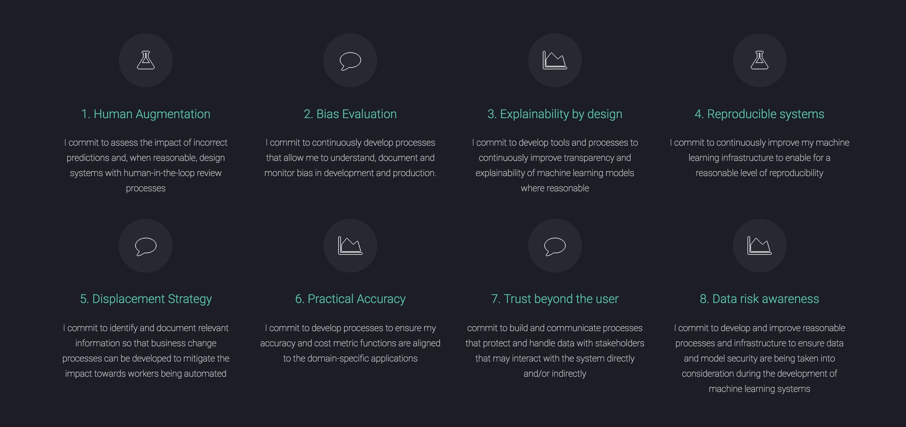
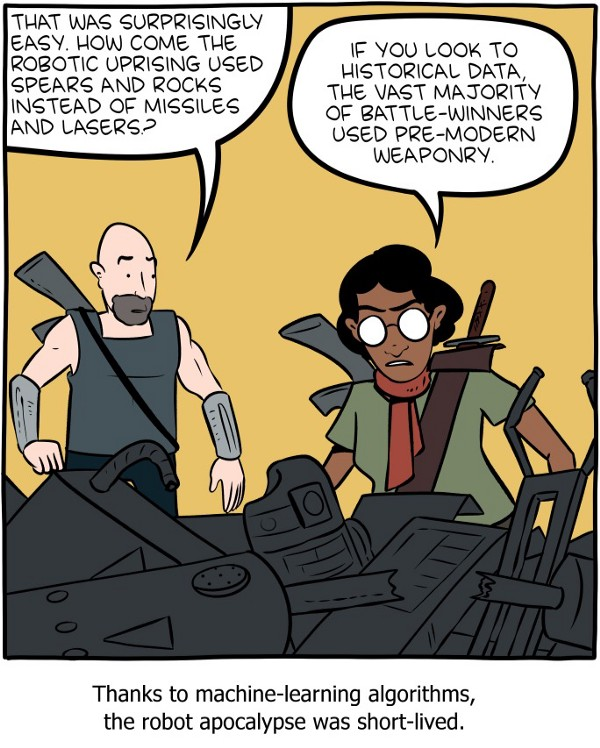
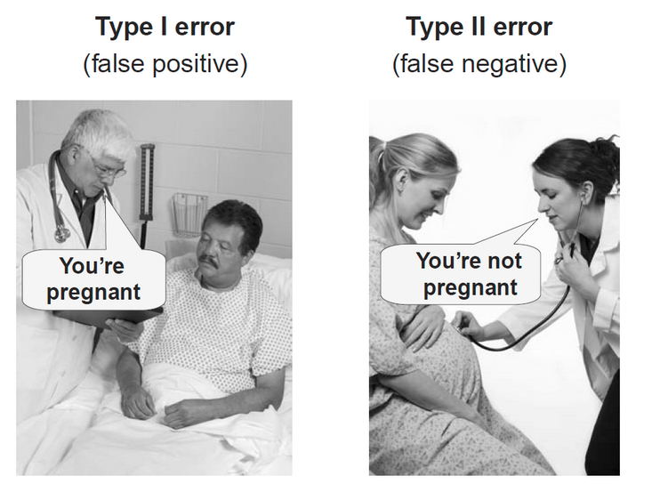
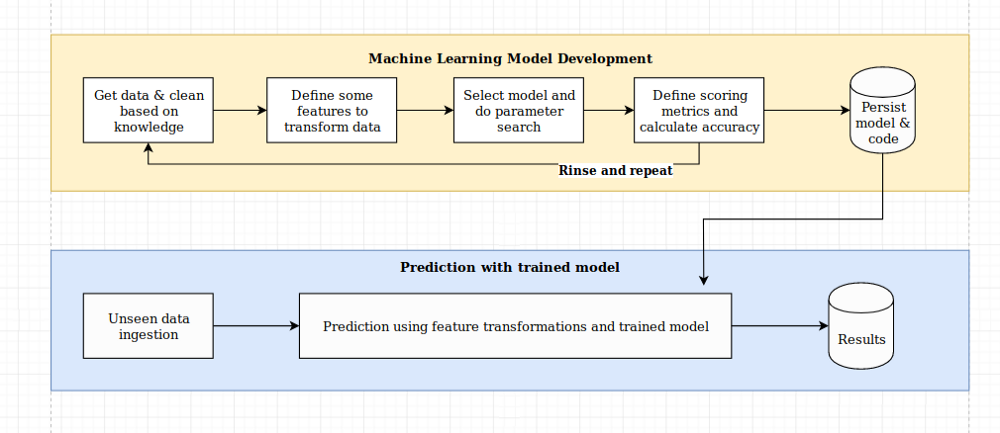

<!-- .slide: data-background="images/network-background.jpg" class="background" -->

<h2>The Institute for Ethical AI & ML</h2>
<h3>Meditations on First Deployment</h3>

<!--Best practices for folling out machine learning systems to automate internal processes at scale across B2B sectors-->

   
   
   
    Alejandro Saucedo | <a href="">a@ethical.institute</a>  
    <a href="http://twitter.com/AxSaucedo">@AxSaucedo</a> 
    <a href="http://linkedin.com/in/AxSaucedo">in/axsaucedo</a> 
   

[NEXT]
<!-- .slide: data-background="images/network-background.jpg" class="background" -->

<h2>The Institute for Ethical AI & ML</h2>
<h3>Meditations on First Deployment</h3>

<table class="bio-table" style="margin-top: -30px">
  <tr>
    <td style="float: left">
         
        
         
        Alejandro Saucedo
         
         
    </td>
    <td style="float: left; color: white; font-size: 0.7em;">

         
        Chief Scientist
         
        <a style="color: cyan" href="http://e-x.io">The Institute for Ethical AI & ML</a
         
         
         
        

         
        Head of Solutions Eng. & Sci.
         
        <a style="color: cyan" href="http://eigentech.com">Eigen Technologies</a>
         
         
        Chief Technology Officer
         
        <a style="color: cyan" href="#">Hack Partners</a>
         
         
        Software Engineer
         
        <a style="color: cyan" href="#">Bloomberg LP.</a>

    </td>
  </tr>
  <tr>
  </tr>
</table>

[NEXT]

<!-- .slide: data-background="images/network-background.jpg" class="background smallquote" -->

## Today

> Background
>  
>  
> New complexities
>
> Framework
> 
> Questions

[NEXT]
<!-- .slide: data-state="flashing" data-background="images/ethical.png" data-background-opacity="0.5" data-background-color="black" class="background smallquote" style="color: white" -->

# Institute for Ethical AI & ML

[NEXT]
<!-- .slide: data-background="images/parti.png" class="background smallquote" style="color: white" -->
## About the institute

We are a UK-based research centre formed by cross functional teams of applied STEM researchers, philosophers, industry experts and software engineers 

[NEXT]
<!-- .slide: data-background="images/parti.png" class="background smallquote" style="color: white" -->
## Applied research

We develop industry frameworks and practical research that empowers technologists to design, develop and deploy of machine learning systems responsibly.

[NEXT]
<!-- .slide: data-background="images/parti.png" class="background smallquote" style="color: white" -->

## The new complexity

[NEXT]
<!-- .slide: data-background="images/parti.png" class="background smallquote" style="color: white" -->
## It gets harder

[NEXT]
<!-- .slide: data-background="images/parti.png" class="background smallquote" style="color: white" -->
## The core Principles

## http://ethical.institute/

[NEXT]
<!-- .slide: data-background="images/particles.gif" class="background smallquote" -->

# #LetsDoThis

[NEXT SECTION]
<!-- .slide: data-background="images/parti.png" class="background smallquote" style="color: white" -->
# 1. Definitions

[NEXT]
<!-- .slide: data-background="images/parti.png" class="background smallquote" style="color: white" -->

 
<h1>Bias</h1>
 
<h3>Any non-trivial decision has a bias</h3>

[NEXT]
<!-- .slide: data-background="images/parti.png" class="background smallquote" style="color: white" -->
# The example
## Reducing abstraction 

[NEXT SECTION]
<!-- .slide: data-background="images/partistat.png" class="background smallquote" style="color: white" -->

# 3. The Framework

[NEXT]
<!-- .slide: data-background="images/space.jpg" class="background smallquote" style="color: white" -->

### An example:
# Candidate Automation

Machine learning system that automates 

candidate selection

[NEXT]
<!-- .slide: data-background="images/partistat.png" class="background smallquote" style="color: white" -->

## An Assessment Criteria

#### The Machine Learning Maturity Model

<table style="font-size: 35px; margin-top: -35px">
	<tbody>	
    <tr>
		<td>
			#1
		</td>
		<td>
			Practical benchmarks
		</td>
	</tr>
	<tr>
		<td>
			#2
		</td>
		<td>
			Explainability by justification
		</td>
	</tr>
	<tr>
		<td>
			#3
		</td>
		<td>
			Infrastructure for reproducible operations
		</td>
	</tr>
	<tr>
		<td>
			#4
		</td>
		<td>
			Data and model assessment processes
		</td>
	</tr>
	<tr>
		<td>
			#5
		</td>
		<td>
			Privacy enforcing infrastructure
		</td>
	</tr>
	<tr>
		<td>
			#6
		</td>
		<td>
			Operational process design
		</td>
	</tr>
	<tr>
		<td>
			#7
		</td>
		<td>
			Change management capabilities
		</td>
	</tr>
	<tr>
		<td>
			#8
		</td>
		<td>
			Security risk processes
		</td>
	</tr>
</tbody></table>

[NEXT]
<!-- .slide: data-background="images/partistat.png" class="background smallquote" style="color: white" -->

## Creating a checklist 

#### From principles to a practical questionnaire

<table style="font-size: 20px; margin-top: -35px">
	<tbody>	
    <tr>
		<td>
			#1
		</td>
		<td>
			Practical benchmarks
		</td>
	</tr>
	<tr>
		<td>
			#2
		</td>
		<td>
			Explainability by justification
		</td>
	</tr>
	<tr>
		<td>
			#3
		</td>
		<td>
			Infrastructure for reproducible operations
		</td>
	</tr>
	<tr>
		<td>
			#4
		</td>
		<td>
			Data and model assessment processes
		</td>
	</tr>
	<tr>
		<td>
			#5
		</td>
		<td>
			Privacy enforcing infrastructure
		</td>
	</tr>
	<tr>
		<td>
			#6
		</td>
		<td>
			Operational process design
		</td>
	</tr>
	<tr>
		<td>
			#7
		</td>
		<td>
			Change management capabilities
		</td>
	</tr>
	<tr>
		<td>
			#8
		</td>
		<td>
			Security risk processes
		</td>
	</tr>
</tbody></table>

 
<ul>
    <li>Each has a set of questions for supplier compliance</li>
     
    <li>Each question points out potential Red Flags</li>
</ul>

[NEXT]
<!-- .slide: data-background="images/partistat.png" class="background smallquote" style="color: white" -->

## Practical benchmarks
 

Ensuring there are process to evaluate the right metrics:
<ul>
    <li>Accuracy</li>
    <li>Cost functions</li>
    <li>Time</li>
    <li>Time-to-accuracy</li>
</ul>

[NEXT]
<!-- .slide: data-background="images/partistat.png" class="background smallquote" style="color: white" -->

## Explainability by justification

 

Explainability through domain knowledge,
together with feature importance analysis

[NEXT]
<!-- .slide: data-background="images/partistat.png" class="background smallquote" style="color: white" -->

## Data and model assessment processes

[NEXT]
<!-- .slide: data-background="images/partistat.png" class="background smallquote" style="color: white" -->

## Infrastructure for reproducible operations

[NEXT]
<!-- .slide: data-background="images/partistat.png" class="background smallquote" style="color: white" -->

## Privacy enforcing infrastructure

Build 
processes to 
use and protect 
user data & privacy,
and 
make sure they are communicated

[NEXT]
<!-- .slide: data-background="images/partistat.png" class="background smallquote" style="color: white" -->

## Operational process design

 

Assess impact of incorrect predictions

and design with human-in-the-loop review

where reasonable

[NEXT]
<!-- .slide: data-background="images/partistat.png" class="background smallquote" style="color: white" -->

## Change management capabilities

Identifying and documenting
impact of technology towards
workers being displaced

[NEXT]
<!-- .slide: data-background="images/partistat.png" class="background smallquote" style="color: white" -->

## Security risk processes

Develop processes and infrastructure
to ensure data and model security 
are taken into consideration

[NEXT]
<!-- .slide: data-background="images/partistat.png" class="background smallquote" style="color: white" -->

## AI Procurement Framework

<ul>
     
    <li>
        A set of tempaltes to support industry practitioners and suppliers in AI tenders. 
    </li>
     
    <li>
        Fully open source, built using our "Machine Learning Maturity Model".
    </li>
</ul> 

[NEXT]
<!-- .slide: data-background="images/partistat.png" class="background smallquote" style="color: white" -->

## Creating a checklist 

#### From principles to a practical questionnaire

<table style="font-size: 20px; margin-top: -35px">
	<tbody>	
    <tr>
		<td>
			#1
		</td>
		<td>
			Practical benchmarks
		</td>
	</tr>
	<tr>
		<td>
			#2
		</td>
		<td>
			Explainability by justification
		</td>
	</tr>
	<tr>
		<td>
			#3
		</td>
		<td>
			Infrastructure for reproducible operations
		</td>
	</tr>
	<tr>
		<td>
			#4
		</td>
		<td>
			Data and model assessment processes
		</td>
	</tr>
	<tr>
		<td>
			#5
		</td>
		<td>
			Privacy enforcing infrastructure
		</td>
	</tr>
	<tr>
		<td>
			#6
		</td>
		<td>
			Operational process design
		</td>
	</tr>
	<tr>
		<td>
			#7
		</td>
		<td>
			Change management capabilities
		</td>
	</tr>
	<tr>
		<td>
			#8
		</td>
		<td>
			Security risk processes
		</td>
	</tr>
</tbody></table>

 
<ul>
    <li>Each has a set of questions for supplier compliance</li>
     
    <li>Each question points out potential Red Flags</li>
</ul>

[NEXT]
<!-- .slide: data-background="images/partistat.png" class="background smallquote" style="color: white" -->
# Next steps

Applying this thinking into your actual projects 

[NEXT SECTION]
<!-- .slide: data-background="images/network-background.jpg" class="background smallquote" -->

# 4. Wraping up

[NEXT]

<!-- .slide: data-background="images/network-background.jpg" class="background smallquote" -->

## Today

> The Institute
>  
>  
> AI Procurement Framework
>
> Next stesp
> 
> Questions

[NEXT]
<!-- .slide: data-background="images/network-background.jpg" class="background" -->
## The ML Principles
<a href="">ethical.institute/principles.html</a>

 
## Procurement Framework
<a href="">ethical.institute/rfx.html</a>

[NEXT]
<!-- .slide: data-background="images/network-background.jpg" class="background" -->

<h2>The Institute for Ethical AI & ML</h2>
<h3>Meditations on First Deployment</h3>

<!--Best practices for folling out machine learning systems to automate internal processes at scale across B2B sectors-->

   
   
   
    Alejandro Saucedo | <a href="">a@ethical.institute</a>   
    <a href="http://twitter.com/AxSaucedo">@AxSaucedo</a> 
    <a href="http://linkedin.com/in/AxSaucedo">in/axsaucedo</a> 
   

